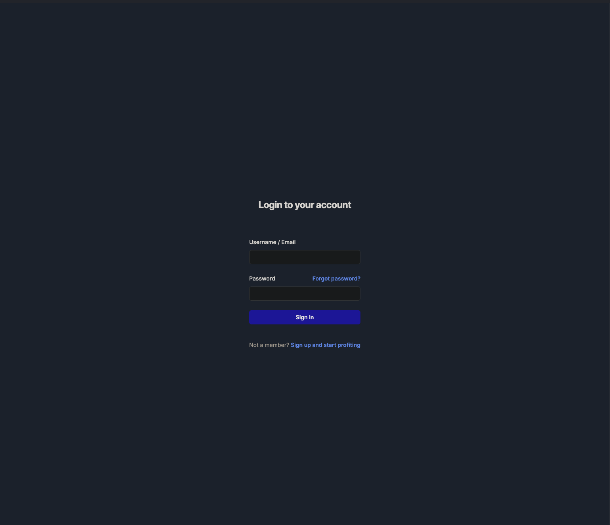
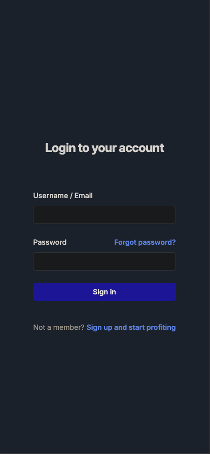
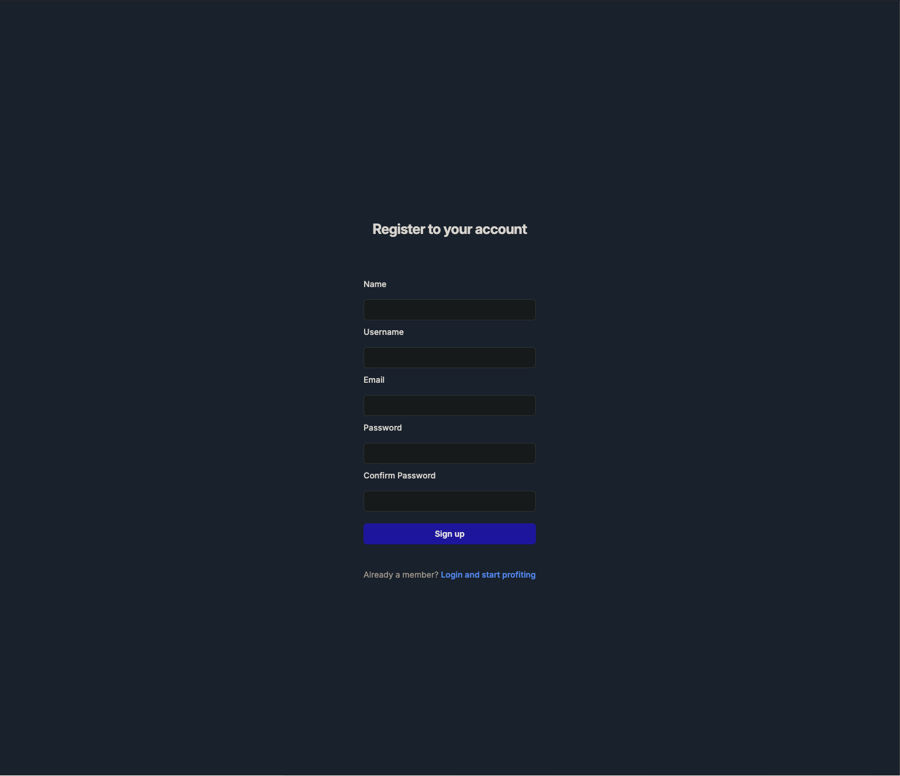
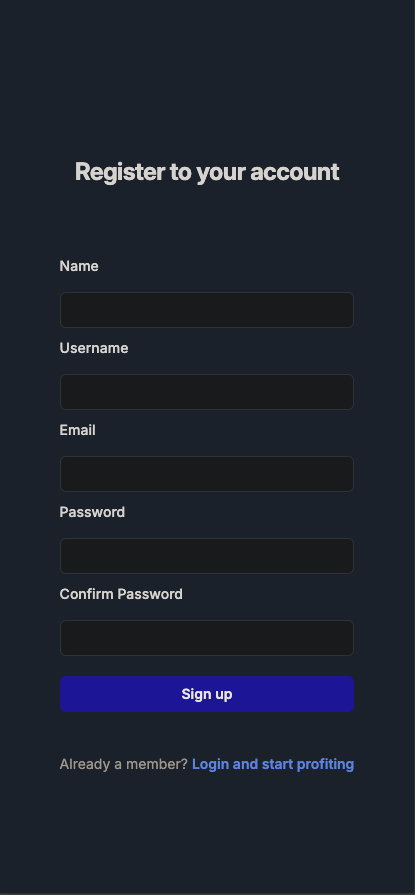

# Finance Tracker

## User stories:

1. ### User has to log in/sign up when they open the application
   1. Setup Log in and Sign up - DONE
   2. Setup CSRF tokens for security - DONE
   3. Setup Authentication - User Flask-Login (didn't use Next because of its unpredicted behaviour)
   4. UI using tailwind CSS - DONE
   5. Salted password - TBD
   6. JWT - TBD
   7. Forgot Password - Add as another user story
   
   ### Screenshots

2. ### User has to create a timesheet with expense
   1. Create expense model with many to one mapping with user
   2. Create POST API to add expense with user ID
